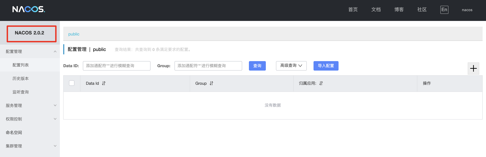
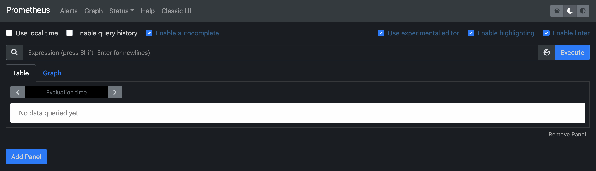
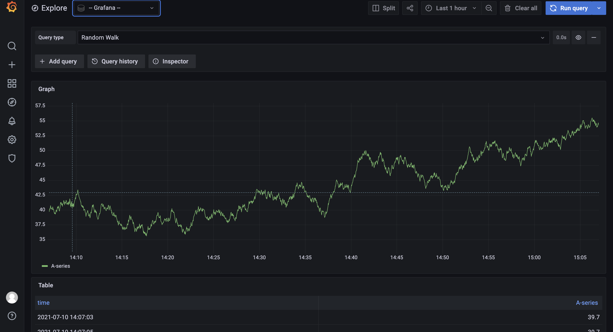

## wxw-alibaba项目

该项目集成阿里社区最新技术涉及 nacos、sentinel、seate 服务之间配置动态管理、服务注册中心、服务熔断、降级、限流、分布式事务等，从综合性的提升每一个技术人对技术和架构的理解，帮助大家能够快速成长。

> 主要技术组件

- **[Sentinel](https://github.com/alibaba/Sentinel)**：Sentinel以“流量”为切入点，在流量控制、并发、熔断、负载保护等方面提供解决方案，保障服务稳定性。

- **[Nacos](https://github.com/alibaba/Nacos)**：一个易于使用的动态服务发现、配置和服务管理平台，用于构建云原生应用程序。

- **[RocketMQ](https://rocketmq.apache.org/)**：低延迟、高性能、高可靠、万亿级容量、灵活扩展的分布式消息和流媒体平台。

- **[Dubbo](https://github.com/apache/dubbo)**：一个高性能的、基于 Java 的开源 RPC 框架。

- **[Seata](https://github.com/seata/seata)**：高性能、易用的微服务架构分布式事务解决方案。

- **[阿里云ACM](https://www.aliyun.com/product/acm)**：一个应用配置中心，可以集中管理应用配置，在分布式环境下实现实时配置推送。

- **[阿里云OSS](https://www.aliyun.com/product/oss)**：一种加密且安全的云存储服务，可存储、处理和访问来自世界任何地方的海量数据。

- **[阿里云短信](https://www.aliyun.com/product/sms)**：覆盖全球的短信服务，阿里短信提供便捷、高效、智能的通讯能力，帮助企业快速联系客户。

- **[阿里云SchedulerX](https://www.aliyun.com/aliware/schedulerx?spm=5176.10695662.784137.1.4b07363dej23L3)**：精准、高可靠、高可用的定时作业调度服务，响应时间秒级..

##  Nacos

### 前言

一个更易于构建云原生应用的动态服务发现、配置管理和服务管理平台。

> 主要功能

- 配置管理
- 服务发现

### 环境

#### 1.  压缩包 启动nacos

> 导读：https://nacos.io/zh-cn/docs/quick-start.html

#### 2. Docker 启动 nacos

> 导读：https://docs.docker.com/engine/reference

快速启动

```bash
# clone 项目
git clone https://github.com/nacos-group/nacos-docker.git
cd nacos-docker

# 单机模式 Derby
docker-compose -f example/standalone-derby.yaml up
```

查看docker 启动的应用容器

 

测试预览地址

- `nacos` ：http://localhost:8848/nacos    [nacos/nacos]

   

- `prometheus` : http://localhost:9090/   

   

- `grafana` : http://localhost:3000/.    [admin/admin (默认账户)] 

   

### 使用

#### 1. 基于resttemplate实现服务调用

- 首先基于上面环境2，docker方式启动 nacos 服务端

- 在项目 `wxw-alibaba/` 目录下依次启动 生产者`alibaba-producer-client` 、消费服务`alibaba-consumer-client` ，等启动成果后

- 测试服务调用：使用消费服务接口 以 rest直连的形式进行 RPC 调用,如下提示，说明调用成功了

  ```bash
  mac@wxw example % curl http://localhost:9001/nacos/consumer/2021
  nacos registry, serverPort: 8001,id = 2021%
  ```

#### 2. 基于openfeign实现服务调用

#### 3. 基于dubbp 实现服务调用


### 问题

（1）**Get https://registry-1.docker.io/v2/: net/http: TLS handshake timeout（Docker镜像拉取错误）**

- 可以尝试的方法：[方法一: 添加加速镜像](https://blog.csdn.net/yyj108317/article/details/105875582/)  [注意：文件权限、所属分组]

（2）**UnknownHostException: alibaba-producer-client] with root cause** 

- 检查引用的依赖是否正确
- 如果是`resttemplate` 检查该配置 是否有加 `@LoadBalanced` 注解

---


## Sentinel


